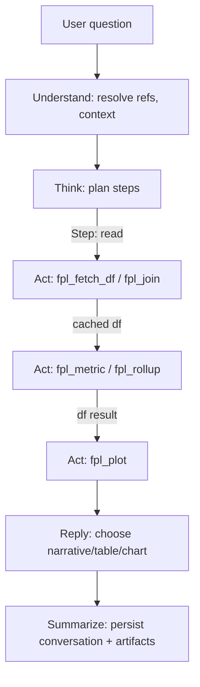

# Integrating Alfred Core with an FPL Data Corpus to Build a Domain-Specific BI and Visualization Agent

## Executive summary

This report assesses how to integrate your Alfred orchestration package (repo: `jv92admin/alfred-core`) with your Fantasy Premier League SPL data corpus (repo: `jv92admin/fpltools`) to produce a domain-specific “BI / visualization engineer on demand” agent. The research began by enumerating available connectors (only entity["company","GitHub","code hosting platform"] was enabled) and then auditing those two repos via the connector (no other repos were reviewed, per your constraint).

The core architectural fit is strong: Alfred already implements a structured, multi-stage orchestration pipeline (Understand → Think → Act loop → Reply → Summarize) and uses schema-validated outputs to drive deterministic tool execution. Its current tool surface, however, is heavily oriented toward database CRUD and schema introspection rather than “analysis/plotting tools.” To reach the BI “wow moment” (tables _and_ charts on demand), the main engineering task is to add a domain tool layer that can (a) query/shape FPL datasets reliably and (b) render plots deterministically, while preserving Alfred’s guardrails against hallucinated fields and IDs.

A second integration pressure point is schema alignment: `fpltools` is designed as a star-schema style warehouse in entity["company","Supabase","postgres backend platform"] with `dim_*` and `fact_*` tables and FPL-native integer identifiers, while Alfred’s entity/reference system and CRUD assumptions were originally optimized for “LLM-friendly IDs” and FK enrichment. The integration plan below therefore treats “schema grounding” as a first-class contract: a validated, versioned schema layer that the agent tools adhere to, with explicit failure modes when the user requests columns/metrics that do not exist.

Because the web tool in this environment could not retrieve/quote your repos directly (cache restrictions), repo-derived claims below are grounded via explicit file paths and excerpts captured via the GitHub connector rather than web citations. All non-repo assertions are backed by web citations to primary/official documentation and original research.

## Repository audit

### Alfred core as an orchestration and execution engine

From the repo inspection, `alfred-core` is already structured like a production orchestration runtime:

- It uses a graph-based control flow (LangGraph-style stateful workflowing is consistent with the broader LangGraph positioning around explicit control-flow, state transitions, and streaming). citeturn1search15turn1search9  
- It relies on structured outputs with schema validation and retry semantics via Instructor + Pydantic (your `llm/client.py` wraps the OpenAI SDK with Instructor and returns Pydantic model instances). Instructor’s purpose-built positioning is “type safety + validation + automatic retries” for structured outputs. citeturn6search0turn6search9  
- The default tool surface is CRUD-like and compatible with PostgREST-style filtering operators such as `eq`, `lt`, `gte`, `ilike`, `in`, etc., which aligns naturally with Supabase/PostgREST querying. citeturn6search4turn6search2  

Key artifacts discovered (by path) that matter for your BI agent:

- **Entrypoints & streaming UX:** `src/alfred/graph/workflow.py` defines `run_alfred_streaming()` / `run_alfred()` / `run_alfred_simple()` (also summarized in `docs/architecture/core-public-api.md`).
- **Planner:** `src/alfred/graph/nodes/think.py` produces a step plan (read/analyze/generate/write) in a Pydantic model (`ThinkOutput` / `ThinkStep` in `src/alfred/graph/state.py`).
- **Executor loop:** `src/alfred/graph/nodes/act.py` runs steps; tool invocation is expressed as a structured action object and executed by a dispatcher layer.
- **Tool layer (today):** `src/alfred/tools/crud.py` (`db_read`, `db_create`, `db_update`, `db_delete`) + `src/alfred/tools/schema.py` for schema context and filter/operator docs.
- **Deterministic identity & reference layer:** `src/alfred/core/id_registry.py` (`SessionIdRegistry`) ensures the LLM never has to handle raw IDs; it also has lazy FK registration/enrichment patterns.
- **Testing:** `tests/core/` contains unit tests for the registry and model routing, among others. There is evidence of tests targeting determinism (e.g., ref translation round trips in `tests/core/test_id_registry.py`).

Architecturally, this resembles the “reason + act (tool) + observe + iterate” pattern that the literature associates with improved grounding and error recovery. The ReAct work, for example, highlights that interleaving reasoning with actions and environment feedback improves interpretability and reduces hallucination relative to purely internal reasoning. citeturn5search3turn5search13

**Core gap for BI:** Alfred’s “Analyze” and “Generate” patterns are presently positioned as text-only in the architecture docs, and the Act tool dispatcher is largely oriented around DB CRUD. To deliver charts and computed metrics, you need a broader, domain-specific tool registry and executor that can run Python analysis and return artifacts (tables/images) deterministically.

### fpltools as a data ingestion and warehouse layer

From repo inspection, `fpltools` is a clean ingestion pipeline from FPL endpoints into Supabase tables:

- `src/fpl_client.py` wraps FPL endpoints and normalizes core objects (players, teams, gameweeks, fixtures, manager picks, league standings).
- `src/pipeline.py` orchestrates dimension sync (teams, gameweeks, players, fixtures) and fact sync (per-GW player stats, standings snapshots, manager picks).
- `src/database.py` provides a thin Supabase wrapper for upserts/selects.
- `sql/001_initial_schema.sql` defines a warehouse model: `dim_teams`, `dim_positions`, `dim_gameweeks`, `dim_players` plus `fact_player_gw`, `fact_fixtures`, `fact_manager_picks`, `fact_league_standings`.

This aligns well with the type of BI questions you described (fixture difficulty comparisons, price changes over gameweeks, top risers, etc.) because it separates stable dimensions from time-series facts.

**Key gap for BI orchestration:** `fpltools` is not currently packaged as a pip-installable library (it uses `requirements.txt` and scripts), and it does not yet expose “analysis-grade” functions (rolling metrics, percentiles, plotting). It is currently optimized for ingestion and storage, not interactive computation.

### Side-by-side comparison of the two repos

| Dimension | `alfred-core` | `fpltools` | Integration implication |
|---|---|---|---|
| Primary role | Orchestration runtime: plan steps, execute tools, manage conversational state | Data ingestion + storage layer for FPL in Supabase | Treat `fpltools` as the “data platform,” Alfred as the “BI agent runtime.” |
| Entrypoints | `run_alfred_streaming()`, `run_alfred()`, `run_alfred_simple()` (workflow) | `Pipeline.run_full_sync()`, CLI scripts (scripts/sync.py) | You will add a new “domain package” that registers an FPL BI DomainConfig and implements tools. |
| Planner | `ThinkOutput` produces step chains with types (read/analyze/generate/write) | None (imperative ingestion pipeline) | Alfred’s Think should produce BI workflows: “read → analyze → plot → explain.” |
| Tool execution | CRUD tools + schema context + deterministic ref registry | Supabase wrapper (upsert/select) | Add BI tools (query→DataFrame, metrics, plots), not just CRUD. |
| Packaging | Hatch build; core dependencies include LangGraph, Instructor, OpenAI, Pydantic | Requirements file; scripts add `src/` to path | Convert `fpltools` into a proper library (pyproject + package layout) or wrap it as a dependency via a new package. |
| Tests | Pytest suite exists for core determinism and components | No clear test suite beyond scripts | Add tests around BI functions, tool contracts, and reproducibility. |
| Extension points | `DomainConfig`, CRUD middleware, DB adapter, formatters | Pipeline composition, schema SQL | Put all “BI intelligence” in the FPL domain: schema contract + tools + response formatting. |

## Integration architecture and tool contract mapping

### Target integration model

A pragmatic, low-friction architecture is:

1. **Keep Alfred core as-is for orchestration** (planner, memory, streaming, deterministic reference system).
2. **Introduce an “FPL BI domain package”** (a new Python package that depends on both `alfred-core` and `fpltools`).
3. **Add a BI tool registry + executor** that Alfred’s Act node can call when step_type is “analyze” or “generate,” not just “read/write.”
4. **Use the existing Supabase warehouse** as the canonical SPL corpus, but cache/shape into pandas DataFrames for computation and plotting.
5. **Return artifacts** (tables, charts) via a structured “artifact protocol” that Reply can render.

This follows the principle that explicit control flow + explicit tool contracts yields more predictable behavior than relying on the LLM to “just narrate analytics,” consistent with agent design lessons in the literature. citeturn5search3turn5search13

### Concrete mapping: Alfred tool calls → fpltools functions

Today, `fpltools` exposes building blocks rather than BI-ready functions. You should add a small API layer (either inside `fpltools` or in the new domain package) that Alfred tools can call. A clean division is:

- `fpltools.data_access`: stable, typed functions that fetch canonical datasets (as DataFrames).
- `fpltools.analytics`: deterministic computations (metrics tables).
- `fpltools.viz`: plotting functions that output an image file path + metadata.

Below is an example set of function signatures that map well onto Alfred’s step mechanics:

```python
# fpltools/data_access.py
from __future__ import annotations
from dataclasses import dataclass
from typing import Literal, Optional
import pandas as pd

TableName = Literal[
    "dim_players", "dim_teams", "dim_gameweeks", "dim_positions",
    "fact_player_gw", "fact_fixtures", "fact_manager_picks", "fact_league_standings"
]

@dataclass(frozen=True)
class QuerySpec:
    table: TableName
    columns: Optional[list[str]] = None
    filters: Optional[list[tuple[str, str, object]]] = None  # (col, op, value)
    order_by: Optional[str] = None
    order_dir: Literal["asc", "desc"] = "asc"
    limit: Optional[int] = None

class DataAccessError(RuntimeError): ...
class SchemaMismatchError(ValueError): ...

def fetch_table_as_df(spec: QuerySpec) -> pd.DataFrame:
    """
    Fetches a table (or a filtered subset) from Supabase using a controlled filter DSL,
    returning a pandas DataFrame.

    Error modes:
      - SchemaMismatchError: requested columns not in schema contract
      - DataAccessError: upstream DB failures/timeouts/auth
      - ValueError: invalid operator or malformed filters
    """
    ...
```

This function can initially wrap the existing `Database.select()`/Supabase client logic, but must enforce allowed filter operators. PostgREST’s documented filter operator set is a helpful baseline for what’s safe to support. citeturn6search4

Then analytics:

```python
# fpltools/analytics.py
import pandas as pd

class AnalyticsError(RuntimeError): ...

def compute_player_price_time_series(
    player_ids: list[int],
    df_player_gw: pd.DataFrame,
) -> pd.DataFrame:
    """
    Returns columns: [fpl_player_id, gameweek, value]
    Raises AnalyticsError if required cols missing or df empty.
    """
    ...

def compute_top_risers(
    df_player_gw: pd.DataFrame,
    df_players: pd.DataFrame,
    *,
    gw_from: int,
    gw_to: int,
    top_n: int = 10,
) -> pd.DataFrame:
    """
    Returns a table of top price risers between gw_from and gw_to.

    Expected cols:
      - df_player_gw: fpl_player_id, gameweek, value
      - df_players: fpl_id, web_name, team_id, position_id

    Outputs:
      - fpl_player_id, web_name, gw_from, gw_to, value_from, value_to, delta
    """
    ...
```

Plotting:

```python
# fpltools/viz.py
from dataclasses import dataclass
from pathlib import Path
import pandas as pd

@dataclass(frozen=True)
class ChartArtifact:
    kind: str              # "line", "bar", ...
    path: Path             # saved image path
    title: str
    caption: str | None = None

def plot_price_trend(
    df_ts: pd.DataFrame,
    *,
    title: str,
) -> ChartArtifact:
    """
    Uses matplotlib to save a deterministic PNG artifact (no GUI backend).
    """
    ...
```

Matplotlib’s official guidance on saving figures and running headless backends provides the canonical underpinning for “render to file as artifact.” citeturn5search15turn5search17

### How Alfred should call these from Act

To make this integration “feel like Alfred,” you want Act to make calls like:

- `fpl_fetch_df(QuerySpec)` → returns a DataFrame in a step cache (serialized as parquet/arrow or JSON-compact summary + an artifact pointer).
- `fpl_compute(metrics_spec)` → returns a derived DataFrame.
- `fpl_plot(chart_spec)` → returns a `ChartArtifact`.

In other words, you are adding a **BI toolchain** that mirrors CRUD but operates on DataFrames and produces user-facing artifacts.

A key design decision is **whether to let the LLM write SQL**. For safety/determinism, prefer a structured query spec (table + filters + columns) over raw SQL. If you still need flexible joins/aggregations, a safer middle path is to run SQL in a constrained, in-process engine (e.g., DuckDB) where the SQL template is assembled from validated pieces and executed over already-fetched DataFrames. DuckDB’s native ability to query pandas DataFrames is explicitly documented and is a good foundation for “BI flexibility without arbitrary DB access.” citeturn7search1turn7search3

## Data and schema grounding for the SPL corpus

### Required schema fields for core BI questions

Based on `fpltools/sql/001_initial_schema.sql` and the ingestion logic in `pipeline.py`, the minimal set of fields needed to deliver your example BI questions is:

- **Players (current attributes):** player identity, team, position, and current price/value.
- **Player value over time:** per gameweek “value” (or derived) to compute risers and price history.
- **Fixtures + difficulty:** per gameweek fixtures with difficulty ratings to compute upcoming fixture difficulty windows.
- **Gameweek timeline:** to anchor “next 5 gameweeks” semantics.

A normalized “analytics-ready” view typically looks like: `fact_player_gw` joined to `dim_players` joined to `dim_teams` and `dim_gameweeks`.

### Normalization steps before analysis

To prevent “hallucinated columns” and inconsistent joins, a robust BI agent should apply deterministic normalization steps:

- **Coerce types** at ingestion boundaries: gameweek as int, IDs as int, value/price as float.
- **Standardize key names** for joins (e.g., consistent `team_id`, `player_id` naming in intermediate DataFrames).
- **Build canonical join views** once (cached): `players_enriched`, `player_gw_enriched`, `fixtures_enriched`.
- **Enforce time-series completeness rules**: e.g., missing gameweeks remain as NaN and are handled explicitly in rolling computations.

For rolling aggregates (moving averages, rolling ranks), pandas’ rolling/window APIs are the canonical reference. citeturn1search0turn1search1

### A robust schema contract for the agent

To make the agent deterministic, treat schema as a **contract**, not an assumption. Recommended approach:

- Maintain a versioned schema map in code (or generated from SQL) that includes:
  - allowed tables
  - allowed columns per table
  - column types
  - primary key(s) and join keys
- Validate every tool call input against this schema map before execution.
- Fail with “actionable errors” listing valid column names when the user (or LLM) requests non-existent fields.

Two practical options for enforcing the contract:

- **Pandera** for DataFrame schema validation—its `DataFrameSchema(..., strict=True, coerce=True)` is explicitly designed to verify columns and types and to reject unexpected columns. citeturn7search7turn7search4  
- **Pydantic** for tool argument validation—Pydantic v2’s model methods (`model_validate`, explicit typing) are well-suited for validating tool call payloads and producing informative errors upstream. citeturn5search7turn5search2  

For your BI agent, a combined approach is strongest: Pydantic validates *tool inputs*, Pandera validates *DataFrame outputs*.

## Tool design for analysis and plotting

### Tool catalog to implement

A domain-specific BI agent needs a small but complete tool set. The objective is not “many tools,” but “few tools with strong contracts.”

| Tool | Purpose | Deterministic inputs | Output artifact |
|---|---|---|---|
| `fpl_schema()` | Return schema contract (tables/columns/types) | none | markdown schema + JSON |
| `fpl_fetch_df(spec)` | Fetch a table/subset to DataFrame | table, filter DSL, columns | DataFrame artifact pointer |
| `fpl_join(view)` | Build canonical enriched views | view name enum | DataFrame |
| `fpl_metric(spec)` | Compute a metric table | metric enum + params | DataFrame |
| `fpl_rollup(spec)` | Rolling means/ranks, percentiles | cols + window + group keys | DataFrame |
| `fpl_plot(spec)` | Render chart | chart type enum + field refs | PNG/SVG image path + caption |
| `fpl_table_preview(spec)` | Provide a small table preview for UX | max rows/cols | markdown table |

A few key computations map directly to your examples:

- **Fixture difficulty window (e.g., next 5 GW):**
  - join player → team → fixtures where team is home or away
  - reshape to “team, gw, opponent, home/away, difficulty”
  - aggregate mean difficulty over gw range

- **Top price risers over a gw window:**
  - filter `fact_player_gw` to gw range
  - compute `value_to - value_from`, sort desc
  - join to `dim_players` for names/positions/teams

- **Rolling metrics:**
  - rolling mean points, rolling mean minutes, rolling bps, etc (if present)
  - pandas rolling/win functions provide the correct foundation. citeturn1search0turn1search1

### Sample code snippets for tool implementations

Rolling average (pandas):

```python
def add_rolling_mean(
    df: pd.DataFrame,
    *,
    group_key: str,
    order_key: str,
    value_col: str,
    window: int,
    out_col: str,
) -> pd.DataFrame:
    required = {group_key, order_key, value_col}
    missing = required - set(df.columns)
    if missing:
        raise ValueError(f"Missing required columns: {sorted(missing)}")

    df2 = df.sort_values([group_key, order_key]).copy()
    df2[out_col] = (
        df2.groupby(group_key, sort=False)[value_col]
           .rolling(window=window, min_periods=1)
           .mean()
           .reset_index(level=0, drop=True)
    )
    return df2
```

Plot artifact with Matplotlib:

```python
from pathlib import Path
import matplotlib
matplotlib.use("Agg")  # headless backend

import matplotlib.pyplot as plt

def plot_line_chart(df: pd.DataFrame, x: str, y: str, title: str, outpath: Path) -> Path:
    if x not in df.columns or y not in df.columns:
        raise ValueError(f"Missing required columns: {x}, {y}")
    plt.figure()
    plt.plot(df[x], df[y])
    plt.title(title)
    plt.savefig(outpath, dpi=200, bbox_inches="tight")
    plt.close()
    return outpath
```

The pattern “use a non-interactive backend and savefig to file” is a standard approach for server-side chart rendering. citeturn5search15turn5search17

### Mermaid flowchart for planning → tool invocation → rendering



## Safety, determinism, and UX rules

### Preventing hallucinated columns, tables, and metrics

A BI agent fails most often by referencing fields that do not exist. The defenses should be layered and deterministic:

- **Schema-first tool inputs:** every tool spec includes a table/metric/chart enum; reject unknown values before execution.
- **Central schema contract:** tool layer consults a single schema map; schema map is derived from SQL + validated at startup.
- **DataFrame schema validation:** Pandera with `strict=True` rejects unexpected columns and enforces types. citeturn7search7turn7search4
- **Controlled filter operators:** align with PostgREST operator semantics and validate operators explicitly; this reduces ambiguity and supports predictable error messaging. citeturn6search4
- **“Explainable errors”** to the LLM: when a mismatch occurs, respond with:
  - what was requested
  - what was available
  - how to fix (suggest closest column names)
  - whether the user should clarify

### Deterministic tool outcomes and reproducibility

For BI credibility, the same question over the same corpus should yield the same artifacts:

- Fix chart rendering parameters (dpi, bbox rules, consistent sorting).
- Cache canonical joins (players_enriched, fixtures_enriched).
- Make rolling computations explicit (`window`, `min_periods`) and stable. citeturn1search1turn1search0
- For model output determinism, Alfred already sets node-specific temperatures with lower temperatures for “Act”-like precision behaviors; this aligns with the general design goal of deterministic tool calls while allowing richer narrative at the Reply stage. citeturn5search7turn6search0

### UX/output rules: narrative vs table vs chart

A BI/visualization agent should follow consistent output selection rules:

- **Narrative only** when:
  - the user asks “why/should I” questions (strategic advice) and the data retrieval is minimal, or
  - the result is purely definitional (no data needed).

- **Table-first** when:
  - the user asks “compare / rank / list top N” and N ≤ ~25
  - the table can be easily scanned and includes key columns only.

- **Chart-first** when:
  - the user asks “trend over time,” “how did it change,” “distribution,” or “volatility”
  - or the result has > ~25 rows and is numeric/time-series (charts compress better).

Example prompt → artifact mapping:

- “Show the top 10 player price risers from GW20–GW25” → table + optional bar chart.
- “Plot Salah’s price over the last 12 gameweeks” → line chart + a small 5-row tail table.
- “Who in my squad has the toughest fixtures in the next 5 gameweeks?” → table (player, avg FDR, fixture list) + optional heatmap later.

## Roadmap, testing, CI, and packaging

### Prototype roadmap

The following milestones assume “no specific constraint” on compute/hosting, as requested.

| Milestone | Scope | Deliverables | Effort (rough) |
|---|---|---|---|
| BI-ready `fpltools` library layer | Create `data_access`, `analytics`, `viz` modules with stable APIs; add pyproject packaging | pip-installable `fpltools`; documented function signatures; minimal examples | 2–4 days |
| Alfred FPL BI domain package | Implement DomainConfig + schema contract + tool registry | `alfred_fpl_bi` package; `register_domain()` on import; basic “read → analyze → reply” flows | 2–5 days |
| Deterministic plotting artifacts | Matplotlib headless rendering + artifact protocol | PNG/SVG output; chart metadata; Reply rendering rules | 1–3 days |
| Safety hardening | Schema validation, error modes, guardrails | Column validation, operator validation, structured error objects | 1–3 days |
| UX polish | Narrative/table/chart selection + examples | Prompt-to-artifact mapping examples; consistent formatting | 1–2 days |
| Integration demo | End-to-end demo on your SPL corpus | “Wow moment” flows: fixture difficulty & price trends rendered as charts | 1–2 days |

### Testing strategy and example test cases

Testing must cover both correctness and determinism.

**Unit tests (fast):**
- Schema contract validation:
  - “unknown column” rejects tool spec
  - “wrong dtype” coerces or errors deterministically (Pandera strict/coerce behavior). citeturn7search7turn7search4
- Analytics correctness:
  - top risers computation on a known small fixture dataset
  - rolling mean correctness on synthetic data (pandas rolling semantics). citeturn1search1turn1search0
- Plot determinism:
  - same input DataFrame and spec → byte-identical or hash-identical output path content (where feasible)

**Integration tests (slower):**
- “query → compute → plot” on a small fixture of real-ish data:
  - ensures tool pipeline works end-to-end
- “act failure modes”:
  - missing data: empty DataFrame must lead to a graceful response, not a crash
  - partial data: warnings and fallbacks

**CI considerations:**
- Neither repo obviously includes a GitHub Actions workflow from the audit; adding CI is worthwhile to lock in determinism.
- Pin Python versions and key libs (`pandas`, `matplotlib`, `supabase`, `pydantic`) to reduce environment drift.

### Packaging and dependency notes

To publish “Alfred as pip-installable with fpltools integration” cleanly, aim for:

- **Keep `alfred-core` minimal** (orchestration + schemas + determinism; no domain deps).
- **Package `fpltools` properly** (pyproject, `src/fpltools/` layout, entrypoint scripts).
- **Create a separate integration package** (e.g., `alfred-fpl-bi`) that depends on both, and registers the domain on import.

Core dependency rationale (grounded in upstream docs):

- Instructor for structured outputs and validation-driven retries. citeturn6search0turn6search9
- Pydantic for typed tool inputs and explicit schema validation. citeturn5search7turn5search2
- Supabase client initialization as the canonical DB entrypoint. citeturn6search2
- Optional: DuckDB to support safe, local analytical SQL over DataFrames for flexible BI while avoiding arbitrary query execution against production stores. citeturn7search1turn7search3

If you want the agent to feel analytically “serious,” strongly consider adding a strict DataFrame validation layer (Pandera or Great Expectations). Pandera is lighter-weight for in-process validation and directly targets pandas schemas. citeturn7search7turn7search4